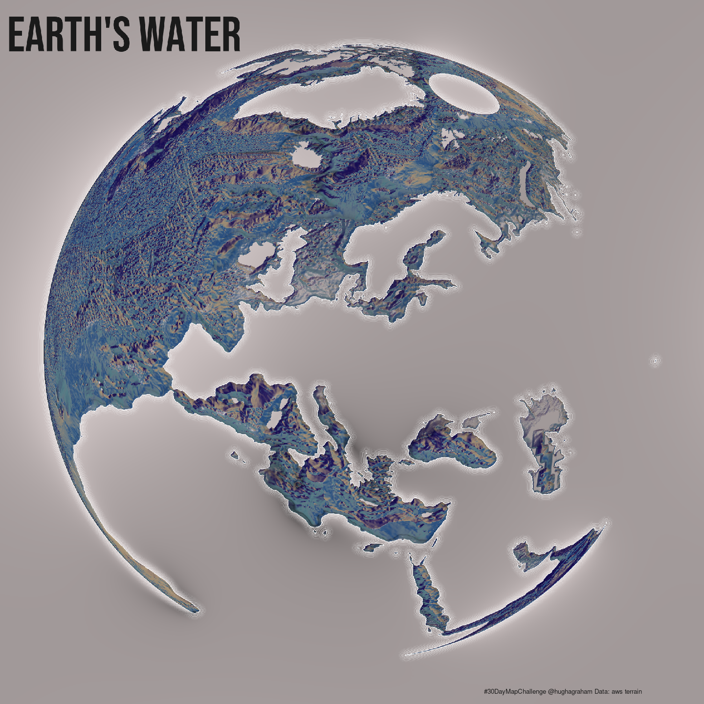

# Hugh-30DayMapChallenge

Some 30 Day Map challange maps. Let's see how we get on. I'm hoping to make sure that all maps are reproducible and don't rely on manual downloads etc. Anyway...

## Day1 - Points:

## Day2 - Lines:

## Day3 - Polygons:

  
   

 

## Day4 - Hexagons:

## Day5 - Open Street Map

## Days6:8 - Red, Green Blue

## Day9 - Monochrome

## Day10 - Raster

## Day 11 - 3D

## Day 16 - Rural/Urban

## Day 17 - Land

## Day 18 - Water

